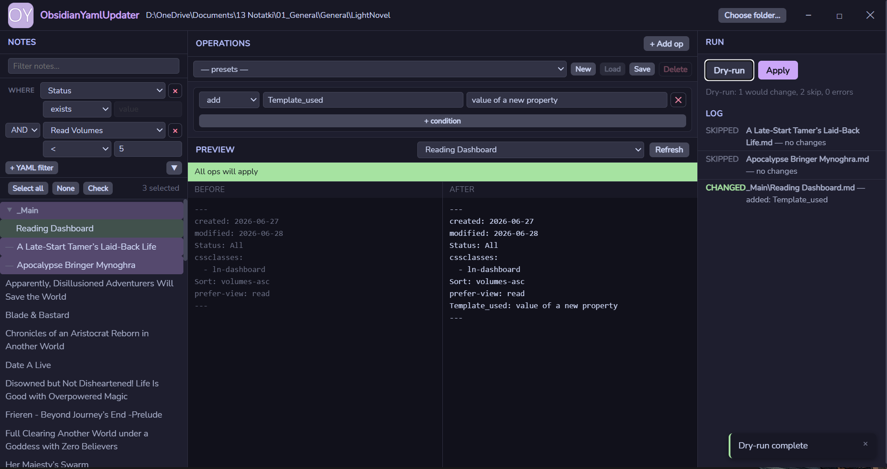

# ObsidianYamlUpdater

A local desktop tool for batch-editing the YAML frontmatter of Obsidian notes. Pick your vault folder, select the notes you want to change, define operations (add, set, delete, rename fields, or modify list fields) with optional conditions, preview the changes on a sample note, run a dry run across all selected notes, then apply. Every run writes a timestamped log and a one-shot undo file. No server, no network, no database — it reads and writes local files only.



## Features

**Operations**
- `add` — add a key only if it doesn't already exist
- `set` — create or overwrite a scalar field
- `delete` — remove a key entirely
- `rename` — rename a key, preserving its value
- `list-add` — append an item to a YAML list field (creates the list if missing)
- `list-remove` — remove an item from a YAML list field

**Conditions** (any operation can be guarded by one or more conditions)
- Key exists / key missing
- Value equals / value contains
- Numeric comparisons: `>`, `<`, `>=`, `<=`
- Date comparisons: before / after (ISO 8601)
- Folder scope: note is in folder / not in folder (direct children or recursive)

**Other**
- Tree view of vault with expand/collapse and inline filtering
- Select all / deselect all
- Before/after preview on any single note
- Dry run across all selected notes before committing
- One-click apply with mandatory dry-run gate
- Accept (discard undo) or Undo last run
- Timestamped log files written next to the exe (`logs/`)
- Preset save/load/delete for reusing operation sets
- Single `.exe`, no installer required

## Download & run

1. Download `ObsidianYamlUpdater.exe` from the [latest release](../../releases/latest).
2. Place it anywhere — a `logs/` folder and a `presets/` folder will be created next to it on first run.
3. Double-click to run. No installation needed.

**System requirements:** Windows 10 or later (64-bit).

## Build from source

**Prerequisites:** Go 1.23+, Node.js (LTS), and the Wails CLI.

```powershell
go install github.com/wailsapp/wails/v2/cmd/wails@latest
```

**Run in dev mode** (hot-reload frontend, live Go backend):

```powershell
wails dev
```

**Build release exe:**

```powershell
wails build
# output: build/bin/ObsidianYamlUpdater.exe
```
